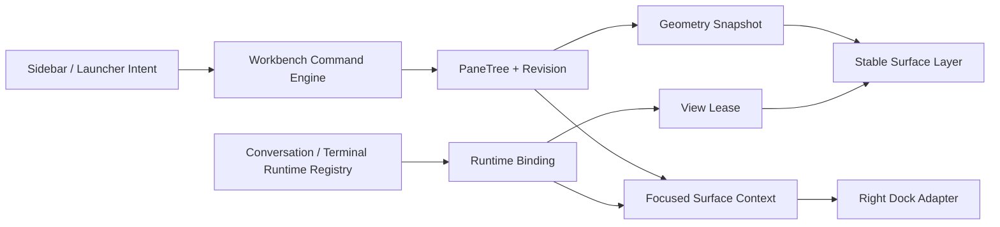

# Session Workbench Dockable Pane Architecture Design

| Metadata | Content |
|---|---|
| Status | Release baseline / official implementation baseline (target architecture and current implementation boundaries recorded separately) |
| Version | v0.5 |
| Date | 2026-08-31 |
| Applicable baseline | Issue #659 / PR #662; Desktop and WebUI share the multi-Pane Workbench |

Research basis: [OTTY multi-session, chunking, focus, and file Pane architecture breakdown](../reverse-engineering/otty/1.3.1/pane-architecture.md) · [OTTY current implementation](../reverse-engineering/otty/1.3.1/current-state.md)

> **Current implementation note**: The Workbench is enabled by default; `VITE_LIVEAGENT_SESSION_WORKBENCH=0` is only used for fallback. Desktop stores the layout topology locally; a restored terminal first enters a dormant placeholder, and the PTY/SSH is only created after the user confirms. WebUI always starts from a single Root Pane for the current session each time it opens, and does not restore an old layout from the browser. Attachment drop/paste on both ends carries `conversationId` synchronously at the event landing point.

## 1. Conclusions of This Round of Requirements

The ReactorPro session page should evolve from:

```text
Project / Session Sidebar | Single Conversation + page-level ChatHeader | Right Dock
```

into:

```text
App-level top Chrome
Project / Session Sidebar | Window-level dockable workbench | Fixed Right Dock
                   ├── Conversation Pane × N
                   ├── Local Terminal Pane × N
                   └── SSH Terminal Pane × N
```

This round is not simply wrapping a drag container around the old session page; it changes the page host relationship:

1. The two stable buttons at the top right belong to the entire application, not to any Conversation Pane.
2. Model and execution mode selection moves down from `ChatHeader` into each conversation's input toolbar.
3. A complete conversation view is encapsulated as an independent, stable, movable `ConversationSurface`.
4. Conversation, Local Terminal, and SSH Terminal use the same `PaneFrame`, docking, moving, closing, and compact mode.
5. Dragging an existing conversation from the left means reusing that conversation; the same conversation will not create a second DOM or Runtime.
6. Dragging a workspace from the left means creating a new conversation for that workspace and placing the new conversation at the drop location.
7. The canvas is window-level rather than project-level; conversations from different workspaces can coexist, but each Pane must carry unambiguous project context.
8. The right-side file tree is still expanded by the button at the top right of the app, defaulting to opening Files; the file tree is not turned into a draggable Pane in the first phase.
9. The Right Dock follows the project context of the currently focused Pane, but clicking the Right Dock does not change the workbench business focus.
10. The underlying layer continues to use an encodable, restorable binary `PaneTree`, not long-lived overlapping free-floating windows.

This capability set is feasible on the existing React + Tauri + xterm.js framework, but the hard part has shifted from "terminal docking" to "splitting the single-conversation orchestration of `ChatPage` into multi-instance controllers bucketed by `conversationId`". This split must be completed first and cannot be bypassed by copying the entire `ChatPage`.

## 2. Corrections to the Old Plan in v0.5

| Topic | v0.4 | v0.5 Decision |
|---|---|---|
| Conversation host | A single `activeConversation` Pane | Multiple `conversation` Panes, mounted uniquely by `conversationId` |
| Conversation ID | Layout does not save concrete IDs | Conversation Spec saves a stable `conversationId`; runtime data still does not enter the layout |
| Layout scope | One PaneTree per project | One PaneTree for the main window, each Surface carrying its own `ProjectRef` |
| Workspace switching | Switching replaces the whole project layout | Clicking follows existing navigation; dropping creates a new conversation for that project on the current canvas |
| Conversation drop | A later capability, rejected in MVP | Core capability; move/focus if it already exists, insert if not open |
| Workspace drop | Undefined | Create a new draft conversation for that project, then atomically insert it at the target position |
| Page Header | Global Chat Header including model selection | `AppWorkbenchChrome` only holds app-level actions; model selection moves into the Composer |
| Top-right entry point | `ChatHeader.trailingActions` | Fixed in App Chrome, does not move with the Pane |
| File tree | Could become a central Folder Pane | Fixed in the Right Dock in the first phase; defaults to Files when the button expands |
| Terminal | A separate Pane type | Shares the Pane shell, movement, and compact strategy with Conversation |
| Empty canvas | Not allowed, Conversation cannot be closed | Allowed; shows a droppable workbench empty state |
| Right Dock project | The currently active project | The explicit project reference of the currently focused Surface |
| Implementation order | Active Conversation Host first | Split the Conversation Controller first, then open up multi-conversation Panes |

Retain the correct boundaries from v0.4: PaneTree/Runtime separation, a single interactive View Lease, integer geometry, Revision CAS, lossless round-trip for unknown Surfaces, Native Drop coordinate adaptation, and the three-platform real-machine gate. Desktop enables local layout persistence; WebUI explicitly disables layout persistence.

## 3. Product Interaction Definition

### 3.1 App-level Top Chrome

The top Chrome is fixed at the top of the workbench column and does not participate in the PaneTree:

```text
┌──────────────────────────────────────────────────────────────┐
│ [Open Sidebar]         ReactorPro              [Theme] [Files]│
└──────────────────────────────────────────────────────────────┘
```

- The top right stably keeps the theme button and the file tree button.
- Clicking the file tree button while it is closed: opens the Right Dock and selects the `files` Tab.
- Clicking the file tree button while it is open: collapses the Right Dock.
- The Settings entry that appears when the sidebar is closed is a responsive fallback action and should not become Pane content; it can be kept in the App Chrome or the global menu.
- Notification Toasts, window drag regions, and app navigation belong to App Chrome/Overlay, not to the Conversation DOM.
- Only the blank area of the title bar sets `data-tauri-drag-region`. A Pane drag handle must never carry this attribute, otherwise Pane movement would be misrecognized as native window movement.

### 3.2 Conversation Pane

```text
ConversationSurface
├── PaneChrome
│   ├── workspace name / conversation title / run state
│   └── drag handle, more, close
├── ChatTranscript
├── Progress / Approval / Queue
└── ChatComposerBar
    ├── input area / attachments
    └── [model + mode] [upload] [search] [thinking] [branch] [send]
```

Rules after moving the model selector down:

- Reuse the Provider grouping, search, sorting, Provider settings entry, and the Chat/Agent mode segmenter from the current `ChatHeader`.
- A new conversation is initialized from the global default model; afterward the selection state is saved per `conversationId`.
- A Turn that has already started uses the model snapshot from when it was sent and does not change if the model is changed midway.
- When the Pane narrows, only the Provider icon and a truncated model name are shown; when it narrows further, they go into the toolbar overflow menu and do not cover the send button.
- Popovers use a Portal and must not be clipped by the Pane's `overflow: hidden`.

### 3.3 Left-side Workspace and Conversation Dragging

| Source | Click | Drag to canvas edge/Divider | Already on canvas |
|---|---|---|---|
| Existing conversation | Follow existing select/focus | Open and dock that conversation | Move the existing Pane; do not copy |
| Workspace | Follow existing activation | Create a conversation for that workspace and dock it | Always create a new conversation |
| New terminal | Automatically dock to the focused Pane | Create at the specified position | Create a new Session each time |
| Existing Pane | Focus | Move/swap | Move the existing Pane |

Sidebar rows already have click, batch selection, long-press menu, rename, and management actions, so the entire row must not be crudely set as HTML `draggable`:

- Add a separate drag handle, or only allow Pointer Drag to start from the non-interactive text area.
- Dragging only begins after the mouse moves more than 6px; anything below the threshold is still a click.
- The touch long-press menu takes priority; in the first phase, touch dragging is replaced by an "Open in Workbench" menu.
- Disable dragging during rename, batch selection, menu open, and delete confirmation.
- The drag ghost only shows the title, workspace, and type; it does not copy the real Conversation DOM.

### 3.4 Drop and Docking

- `canvasEdge`: split at the root level with the whole tree as one side — top, bottom, left, right.
- `paneEdge`: split on the target Pane's top, bottom, left, right.
- `divider`: insert on one side of an existing split line.
- `paneCenter`: only used for swapping when moving an existing Pane; new sidebar content does not silently overwrite the target.
- `canvasEmpty`: create a Root Leaf on an empty canvas.

When a sidebar Payload is dropped on a Pane center, deterministic automatic docking is used: right side first, then below if there is not enough space, then search for the nearest splittable ancestor; if the hard minimum size is still not met, reject it, and the Runtime is not created beforehand.

### 3.5 The Precise Meaning of "Compaction"

Pane compaction does not use `transform: scale()`:

- Split Ratio is constrained by the Surface's hard minimum size.
- Below the comfortable width it enters `compact`, hiding secondary titles and moving the toolbar into a menu.
- Conversation guarantees that the input area, send, and model entry are always reachable.
- The Terminal performs xterm Fit, and only then sends the deduplicated cols/rows to the PTY.
- An extremely narrow window only shows the focused Pane; the other Panes pause expensive rendering and do not modify the persistent PaneTree.

## 4. Goals and Non-Goals

### 4.1 First-phase Goals

1. Display multiple conversations and terminals from multiple workspaces side by side in the same window.
2. Support top/bottom/left/right docking, root-level splits, Divider insertion, swap, move, resize, equalize, and close.
3. Moving a conversation does not lose drafts, queues, approvals, scroll, streaming output, or input state.
4. Moving a terminal does not re-Attach, does not lose output, and does not restart the process.
5. Model and mode selection live in each Conversation Composer.
6. The file button at the top right is always findable and opens the File Tree in the fixed Right Dock by default.
7. Dropping a workspace creates a new conversation; dropping a conversation reuses the existing conversation.
8. The Right Dock always uses the validated project context of the focused Pane.
9. The **target architecture** supports restoring the layout on the local machine, and broken references can be repaired; the current official version starts from a single Root Pane, and the old/new UI can be rolled back via a Feature Flag.
10. macOS, Windows, and Linux share the layout core and pass the real-machine matrix.

### 4.2 First-phase Non-Goals

- Do not support tearing a Pane out into a second native window.
- Do not support long-lived floating, overlapping, free coordinates, or arbitrarily scaled cards.
- Do not allow two input-capable views for the same Conversation or Terminal Session at the same time.
- Do not put File Tree, Git Review, Tunnel, Tasks, Skills Hub, or MCP Hub into the PaneTree.
- Do not build a full file editor or a Pane Tab Stack.
- Do not automatically restore Shell processes, and do not automatically submit SSH credentials or trust Host Keys.
- Do not sync window layout, Session ID, drafts, or the desktop Feature Flag through the Gateway.
- Do not automatically authorize an arbitrary external directory dragged in as a workspace.

## 5. Current Code Baseline and Gaps

### 5.1 The Current Page Is a Single-conversation Orchestrator

[`ChatPage.tsx`](../../crates/agent-gui/src/pages/ChatPage.tsx) currently directly assembles a single set of `ChatTranscript` and `ChatComposerBar`, and injects history, run, approval, queue, upload, and draft state through `currentConversationId`. `ApplicationView` then renders a `ChatHeader` above the content.

Therefore `chat.content` must not be cloned; it must be split into:

```text
ChatPage (may be renamed to ChatWorkbenchPage after migration)
├── AppWorkbenchChrome
├── ChatHistorySidebar
├── ConversationRuntimeRegistry   keyed by conversationId
├── WorkbenchController
├── WorkbenchCanvas
└── RightDockPanel
```

### 5.2 Model Selection Is Currently Coupled to the Header

[`ChatHeader.tsx`](../../crates/agent-ui/src/components/chat/ChatHeader.tsx) simultaneously owns the model Popover, Provider grouping/search/sorting, mode switching, theme, settings, and trailing actions. It needs to be split into:

```text
AppWorkbenchChrome
├── ThemeToggle
└── FileTreeToggle

ComposerModelPicker
├── ModelPickerTrigger
├── ProviderModelPickerContent
└── ExecutionModeSegment
```

The model domain data is provided by the Conversation Controller; shared UI does not directly access Tauri or page-level global state.

### 5.3 The Composer Already Has a Suitable Landing Spot

[`ChatComposerBar.tsx`](../../crates/agent-ui/src/pages/chat/ChatComposerBar.tsx) already has upload, Web Search, Thinking, Reasoning, Git Branch, and send controls at the bottom. The model entry goes first in the left tool group and passes a structured contract:

```ts
type ComposerModelSelection = {
  hasModels: boolean;
  currentLabel: string;
  options: SharedModelOption<ProviderId>[];
  selectedValue?: string;
  executionMode: "text" | "tools" | "agent-dev";
  onSelectModel(selection: SelectedModel): void;
  onSelectExecutionMode(mode: "text" | "tools"): void;
  onOpenProviderSettings(providerId: string): void;
};
```

### 5.4 The Right Dock Is Already at the Correct Level

The current `RightDockPanel` is already a sibling of `ApplicationView`, so it is suitable to remain a fixed region. What needs to change:

- `ProjectToolsPanelToggle` moves into `AppWorkbenchChrome`, making the `openFiles()` semantics explicit.
- `projectPathKey/cwd/projectState/fileTreeState` are resolved from `FocusedSurfaceContext`.
- In Workbench mode, the Right Dock no longer mounts an `XTermViewport` that is already occupied by a Pane.

### 5.5 Sidebar Interaction Conflicts

`HistoryRow` and `ProjectRow` already handle selection, renaming, batch operations, long-press, and menus. The newly added dragging must reuse a unified `SidebarSurfaceDragHandle` and lift the Drag Session to the workbench controller; a separate hit-testing algorithm must not be implemented inside each of the two Rows.

## 6. Product Hierarchy and Visual Structure

```text
┌──────────────┬──────────────────────────────────────────────┬─────────────────┐
│              │ App Chrome                         [◐] [Files]│                 │
│ Workspace    ├──────────────────────┬───────────────────────┤ Right Dock      │
│ Sessions     │ Conversation A       │ Conversation B        │ focused project │
│              │ transcript/composer  │ transcript/composer   │ File / Git      │
│ draggable    ├──────────────────────┴───────────────────────┤ SSH / Tasks     │
│ sources      │ Local / SSH Terminal                         │                 │
└──────────────┴──────────────────────────────────────────────┴─────────────────┘
```

Fixed hierarchy:

```text
AppShell
├── LeftSidebar
├── MainColumn
│   ├── AppWorkbenchChrome
│   └── WorkbenchCanvas
├── RightDock
└── GlobalOverlayHost
```

The visuals follow the ReactorPro theme, typography, and density, with the "dock track" as the signature interaction:

- The Pane Header visual height is recommended at 36px, and button hit areas are at least 44×44px.
- The active Pane only adds a 1px focus border and title contrast.
- The four-direction track, center swap area, and final rectangle preview are only shown while dragging.
- Content fills the Pane directly, with no decorative card wrapper.
- Dividers are restrained by default and give feedback on hover/focus; the actual hit width is 8–12px.
- Titles may be omitted, with a Tooltip showing the full conversation, workspace, path, or hostname.

## 7. Overall Architecture and State Ownership



| Layer | Authoritative content | Must not store |
|---|---|---|
| Conversation Registry | drafts, queues, approvals, streams, history, model | Pane Rect |
| Terminal Registry | PTY/SSH, output, Resize, exit state | Pane Rect |
| Runtime Binding | paneId to conversation/session/operation | persistable layout |
| View Lease | which Pane/legacy container owns the interactive view | business data |
| Surface Spec | restorable identity and launch spec | Secret, Prompt, Session ID, transient errors |
| PaneTree | Leaf/Split/Ratio/Focus/Revision | ReactNode, Runtime objects |
| Context Adapter | safe project projection of the focused Pane | new permissions, implicit cwd ownership |

## 8. Core Domain Model

### 8.1 Surface Spec

```ts
type ProjectRef = {
  projectId: string;
  projectPathKey: string;
};

type KnownWorkbenchSurface =
  | { kind: "conversation"; conversationId: string; project: ProjectRef }
  | { kind: "localTerminal"; project: ProjectRef; launchSpec: LocalTerminalLaunchSpec }
  | { kind: "sshTerminal"; project: ProjectRef; launchSpec: SshTerminalLaunchSpec };

type WorkbenchSurfaceSpec =
  | KnownWorkbenchSurface
  | {
      kind: "unsupported";
      originalKind: string;
      raw: Readonly<Record<string, unknown>>;
    };
```

The Conversation ID must be persisted because it is the stable identity for "reusing an existing conversation"; messages, drafts, run state, and model configuration are still managed by the Conversation Store and are not copied into the layout JSON.

The `launchSpec.cwd` semantics are the same for both terminal Surface types: it is the **local project anchor** (the local root for SFTP), not a remote working directory — `create_ssh` canonicalizes it locally just like a local terminal. Therefore the containment validation of `terminalLaunchSpecIsInProject` applies equally to `localTerminal` and `sshTerminal`.

### 8.2 PaneTree

```ts
type PaneRecord = {
  paneId: string;
  surface: WorkbenchSurfaceSpec;
  view: { compactChrome?: boolean };
};

type PaneNode =
  | { type: "leaf"; paneId: string }
  | {
      type: "split";
      splitId: string;
      axis: "horizontal" | "vertical";
      ratio: number;
      first: PaneNode;
      second: PaneNode;
    };

type PersistedWorkbenchLayout = {
  schemaVersion: number;
  scopeId: "main-window";
  revision: number;
  root: PaneNode | null;
  panes: Record<string, PaneRecord>;
  focusedPaneId: string | null;
};
```

`horizontal` means left-right and `vertical` means top-bottom; an empty canvas is expressed as `root: null`.

### 8.3 Invariants

1. Each Leaf in the Tree corresponds to exactly one PaneRecord, and vice versa.
2. A Split has exactly two non-empty children, and ratio is clamped by the minimum size.
3. There is at most one Pane for the same `conversationId`.
4. There is at most one input-capable View Lease for the same Terminal/SSH Session.
5. `focusedPaneId` is null if and only if root is null; otherwise it points to an existing Leaf.
6. Structural edits are only committed through transactions carrying `expectedRevision`.
7. The raw JSON of an unknown Surface round-trips losslessly and must not derive capabilities or start a Runtime.
8. When ProjectRef validation fails, it enters blocked/stale and does not fall back to another project.
9. Layout does not contain Secrets, Prompts, output, uploaded content, or transient errors.
10. Moving does not change the `paneId`, Surface identity, Runtime Binding, or React Key.

## 9. Conversation Runtime Refactor

```ts
type ConversationSurfaceController = {
  conversationId: string;
  project: ProjectRef;
  transcript: ConversationTranscriptSlice;
  composer: ConversationComposerSlice;
  execution: ConversationExecutionSlice;
  approvals: ConversationApprovalSlice;
  model: ConversationModelSlice;
  lifecycle: ConversationLifecycleSlice;
};

type ConversationRuntimeRegistry = {
  get(conversationId: string): ConversationSurfaceController;
  ensure(input: { conversationId: string; project: ProjectRef }): Promise<void>;
  createDraft(project: ProjectRef): Promise<string>;
  subscribe(conversationId: string, listener: () => void): () => void;
};
```

Bucketing by ID is mandatory: Transcript hydration/pagination/errors, Live stream, send/stop/Retry/Compaction, Composer draft/attachments/Prompt history, Queued Turns, approvals, task progress, Provider/model/mode/Thinking/Reasoning, scroll following, and content width state.

Page level can still share the Gateway Bridge, History Client, Provider Catalog, Git Client, and Skills Catalog, but mutable conversation state must be read through `conversationId`.

`PaneSurfaceLayer` renders flat with `paneId` as the React Key; the PaneTree only computes Rects. Moving only updates position and does not remount `ConversationSurface` or `XTermViewport`.

When the same conversation is dropped again: if it already exists, `MOVE_PANE`/focus; only if it does not exist, create a Pane and `ensure()`; a second paneId pointing to the same conversationId is forbidden.

## 10. Model Selector Migration

1. Extract the pure UI `ProviderModelPickerContent` from `ChatHeader.tsx`.
2. Create `ComposerModelPicker`, reusing the Trigger/Popover Content.
3. `ChatComposerBar` gains `modelSelection?: ComposerModelSelection`.
4. The Desktop Controller provides the Selection by ID; WebUI may continue to pass the single-conversation implementation.
5. `ChatHeader` is reduced/replaced by `AppWorkbenchChrome`, and the model Props are removed.
6. Provider settings still open the global Settings; after closing, focus returns to the button of the originating Pane.

Constraints: a model change only affects the next Turn; when unavailable, the reason is explained; the full information is still visible in compact mode; each Picker's `useId` is independent; IME/Popover keyboard operations must not trigger Pane shortcuts.

## 11. Workspace/Conversation Drop Transaction

### 11.1 Typed Payload

```ts
type SidebarWorkbenchPayload =
  | {
      kind: "existingConversation";
      conversationId: string;
      project: ProjectRef;
      title: string;
    }
  | {
      kind: "newConversationForWorkspace";
      project: ProjectRef;
      workspaceName: string;
    };
```

The Pointer Drag Session holds a structured object; the DOM Dataset is only used for hit identification.

### 11.2 Existing Conversation Reuse

```text
DROP(existingConversation)
→ validate Conversation ownership and project existence
→ look up paneByConversationId
→ exists: MOVE_PANE / FOCUS_PANE
→ does not exist: preflight geometry → OPEN_PANE
→ Registry.ensure(conversationId)
→ show on success; on failure keep a retryable error Surface
```

Layout insertion does not wait for the full history to load; as soon as the stable identity is known it can be committed, and Hydrating is shown inside the Surface.

### 11.3 New Conversation for Workspace

```text
DROP(newConversationForWorkspace)
→ validate directory exists, not archived, permissions available
→ preflight target and minimum size
→ create operationToken + non-persistent Placeholder
→ ConversationRegistry.createDraft(project)
→ CAS commit OPEN_PANE(conversationId, target)
→ focus the new Composer
```

- Geometry failure: do not create the conversation.
- Creation failure: remove the Placeholder and show an explicit error.
- Creation succeeded but CAS expired: an empty, unsent draft is safely reclaimed; otherwise it stays in the sidebar with a notice that it was not added to the canvas.
- A late-arriving result must match the operationToken and must not be inserted into a target that was focused later.

## 12. Layout Command Model

```ts
type WorkbenchCommand =
  | { type: "OPEN_PANE"; pane: PaneRecord; target: OpenTarget }
  | { type: "MOVE_PANE"; paneId: string; target: MoveTarget }
  | { type: "SWAP_PANES"; firstPaneId: string; secondPaneId: string }
  | { type: "CLOSE_PANE"; paneId: string }
  | { type: "RESIZE_SPLIT"; splitId: string; ratio: number }
  | { type: "EQUALIZE_SPLIT"; splitId: string }
  | { type: "FOCUS_PANE"; paneId: string };

type WorkbenchLayoutTransaction = {
  expectedRevision: number;
  command: WorkbenchCommand;
  evaluation: LayoutEvaluationContext;
};
```

The Command Engine normalizes intent into internal Mutations. The Reducer is a pure function and does not read the DOM, Runtime, or async state. Failures return `invalid-target | insufficient-space | stale-revision | duplicate-surface | not-found` without modifying the object or Revision.

After closing the focused Pane, focus transfers to the spatially nearest Leaf in the sibling subtree of the collapsed Split; after closing the last one, both root/focus are null.

## 13. Geometry, Dragging, and Rendering

### 13.1 Stable Geometry

- `ResizeObserver` reads the Canvas's actual Rect.
- Geometry outputs Pane/Divider Rects in integer CSS Pixels.
- The stable state uses `left/top/width/height`; Transform is only used for drag ghosts/animations.
- Pointer Down freezes the Geometry Snapshot and Revision; movement only does hit-testing/preview.
- Pointer Up commits once; if the Revision changed, cancel and do not automatically replay the old intent.

Hit-testing priority:

```text
canvas-edge > divider > pane-edge > pane-center
```

The canvas outer edge is recommended at 16px; Pane Edge is 18–28% of the Rect; Drop Preview shows the final Rect.

### 13.2 Divider and Terminal Resize

- Pointer Capture ensures the drag can end even outside the window.
- UI geometry updates at most once per frame.
- xterm Fit can be computed per frame; Runtime Resize is deduplicated and throttled at about 80–100ms, with a final Flush on Pointer Up.
- The Conversation Transcript only responds to width and does not rebuild the virtual list every frame.

### 13.3 Separation of Layout Drag, Path Reference Drag, and Native Drop

Pane/sidebar uses Workbench Pointer Drag; File Tree nodes use an independent
`workspacePath` content drag; Finder/Explorer/File Manager files use Tauri
Native Drop. The three must not share a payload or a commit path:

```ts
type WorkspacePathDragPayload = {
  kind: "workspacePath";
  projectPathKey: string;
  cwd: string;
  relativePath: string;
  entryKind: "file" | "dir";
};
```

```ts
type NativeDropTarget =
  | { kind: "workspaceImport" }
  | { kind: "composerUpload"; paneId: string; conversationId: string }
  | { kind: "terminalBody"; paneId: string }
  | null;
```

The current working tree has already narrowed the upload area to the Composer, and this must be preserved. Files only prepare attachments and are not sent automatically; paths are only escaped and inserted into the Terminal, without an automatic Enter.

When an internal File Tree node is dragged to the Composer, it inserts a mention of the existing file/directory, without uploading or copying the file;
when dragged to a Local/Gateway Terminal in the same project, the xterm paste pipeline inserts the absolute path, escaped according to
POSIX, PowerShell, or cmd rules. Cross-project targets and
SSH Terminals without an explicit local/remote root mapping are always blocked.

## 14. Focus, Shortcuts, and Right Dock Context

- `focusedPaneId` determines the active border, the Right Dock project, and spatial commands.
- The DOM `activeElement` determines keyboard input.

Clicking the Right Dock search, file tree, or menu does not clear `focusedPaneId`, nor does it steal focus back from xterm/Composer.

```ts
type FocusedSurfaceContext = {
  paneId: string;
  surfaceKind: KnownWorkbenchSurface["kind"];
  project: ProjectRef;
  conversationId?: string;
  terminalSession?: TerminalSession;
  displayCwd?: string;
  sshHostId?: string;
  capabilities: {
    files: "none" | "read" | "write";
    git: boolean;
    terminal: boolean;
    sftp: boolean;
    reconnect: boolean;
  };
};
```

Right Dock rules:

1. File button with the Dock closed: open `files` with the focused Context.
2. Focus moves to another workspace: the data source switches to the new ProjectRef.
3. When the user is on Git/SSH/Tasks, an ordinary focus switch does not force a jump to Files; it only falls back when the Tab is not applicable.
4. When there is no Pane, use the currently active workspace in the sidebar; if there is no valid workspace, disable and explain.
5. Terminal cwd is only used for a safe Reveal and cannot change the project, Git root, or permissions.
6. When Conversation and ProjectRef disagree, it is blocked and the current sidebar project is not adopted.

Shortcuts use `Meta` on macOS and `Ctrl` on Windows/Linux. Provide focus/move in four directions, close, equalize, and file tree; Composer/xterm, IME, and Popover/Dialog/Menu consume text input with priority; all dragging has a menu/command equivalent entry point.

## 15. Terminal Surface

```text
TerminalPaneSurface
├── PaneChrome
│   ├── Project / Shell or Host / cwd / state
│   └── drag / more / close
├── Connection or Exit Banner
└── XTermViewport
```

1. `paneId` is the stable React Key, and the Session ID only exists in the Runtime Binding.
2. Moving does not Attach/Dispose, it only changes the Rect.
3. The Terminal obtains the unique `interactive` View Lease, and the Right Dock/Overlay does not mount a second xterm.
4. Resize is decoupled from visual Fit and deduplicated.
5. Local Terminal cwd must be within the allowed range of the owning main project.
6. The SSH Prompt is bound via `operationToken + paneId + promptId`.
7. Restoration only shows the stale launch spec; the user must explicitly click to start/reconnect.
8. Close = terminate (decision changed on 2026-09-02, replacing the earlier Detach-first behavior): the Pane's × and `Meta/Ctrl+Alt+W`
   close that terminal. For a running session, a red confirmation bar first pops up at the top inside the Pane (the same
   kind as the Right Dock's "Close the running terminal '…'?"), and after confirmation `client.close` is called; an exited session is closed directly;
   a dormant/placeholder Pane with no session simply closes the view. Implementation: `lib/workbench/terminalPaneClose.ts`
   (`useTerminalPaneCloseFlow` / `resolveTerminalPaneCloseAction`).
9. A Pane does not disappear before close: the Pane is dismissed in tandem by the page's `closed` event (with a fallback
   after the session confirms leaving the list when the event is lost), so the lease is held until the process ends and the Session does not flash
   in the Right Dock's tab / top-right count badge.
10. Rationale for the changed decision: Detach back to the dock made the Session "blink" at the top right, and users expect closing to mean ending;
    the dangerous action is caught by an in-place confirmation inside the Pane, and the Right Dock's session management entry can still terminate/disconnect.

## 16. File Tree Surface and Right Dock Boundary

The File Tree has been decoupled from being a Right Dock-only panel into a shared Surface and has entered the PaneTree:

- The Right Dock keeps File, Git, SSH/Connection, Tunnel, and Background Tasks.
- The File Tab supports being dragged out or opened in a split view via the menu, using `fileTree:${projectPathKey}`
  as the stable identity.
- File Tree expansion, selection, and scroll state are bucketed by `projectPathKey`.
- The Right Dock is resizable; when the Canvas is narrow, an Overlay is opened instead of permanently compacting all Panes.
- Only one interactive File Tree view is mounted per project; while the Surface is in the Workbench, the Right Dock
  hides the corresponding tab, content, and create entry to avoid duplicate data requests, workspace activity subscriptions, and
  state races. The Pane's × closes the entire tool (`releaseProjectToolFromDock`): the dock tab and
  the persisted `tools.fileTree` are removed together, and the tab does not pop back after the lease is released; only when a Pane
  disappears due to a non-explicit close such as a cleared layout does the Dock reuse the project-level state to restore the tree.
- `FileTreeSurface` is mounted through explicit project/state/client/action props and does not depend on
  `RightDockContext`; the Right Dock and Pane Host are merely different adapter layers.
- Closing a file tree Pane = closing the file tree tool (same treatment as other project tools since 2026-09-02, see §17):
  `tools.fileTree` is removed together with its expansion / selection / search UI state, and is rebuilt from
  "Get Started" with default state when opened again; the project, conversations, and files are not modified.

> Since 2026-09-02, Git review, intranet tunneling, SSH connections, and background tasks also enter the
> PaneTree under the same singleton + lease semantics (`ProjectToolWorkbenchSurface`), and the Right Dock only keeps the terminal session list as a mandatory entry point.
> See [workbench-project-tool-panes.md](workbench-project-tool-panes.md) for design and implementation.

The running terminal list is the recovery entry point after Detach and must be retained; a Session holding a Workbench Lease is hidden entirely from the dock's terminal tab (a terminal appears in only one host at any moment), and after Pane Detach releases the lease it automatically returns to the dock. The SSH overlay's shell tab maintains the mutual exclusion of "placeholder + focused Pane" (the overlay is the SSH connection management entry point, and the tab must remain continuously visible).

## 17. Lifecycle and Close Semantics

| Surface | Main close action | Runtime object result |
|---|---|---|
| Conversation | Close the view | History is not deleted; runs/queues continue per the background policy |
| File Tree / Git review / intranet tunneling / SSH connection / background task | Close Pane = close tool (`releaseProjectToolFromDock`) | Does not modify the project, files, tunnels, SSH sessions, or background processes; the dock tab and `tools[kind]` (the file tree including UI state) are removed together and do not pop back to the dock; a background task is hidden after snapshotting the current process id |
| Running Local Terminal | Terminate after red-bar confirmation inside the Pane | The process tree ends, the Session is removed, and the Pane closes with the `closed` event |
| Exited Local Terminal | Close the view and reclaim the Session | Retained history is cleaned up per the existing policy |
| Connected SSH Terminal | Disconnect after red-bar confirmation inside the Pane | The connection drops, the Session is removed, and the Pane closes with the `closed` event |
| stale Terminal | Close the view | No Runtime |

A Pane's close path is its terminate path (§15 item 8); the Right Dock's terminal session management entry can still terminate/disconnect
sessions inside the dock.

Cascade (Session → Pane): closing a Session leased by a Pane from any source (the Pane's ×, Right Dock, close_project) **also closes that Pane**
(driven by the `closed` event, looked up by Runtime Binding rather than Lease, covering a connecting window in which the host has not yet acquired a lease). A binding that the host "saw during this mount and that then disappeared from the session list" stops at the `session-closed` placeholder (an explicit restart is possible) and never revives itself. A recovery Surface after an app restart is also not granted automatic startup and uniformly stops at the dormant placeholder; only after the user clicks restore is a local or SSH session created according to the launchSpec. The app-exit `close_all` is exempted from the closed cascade by the exit guardrail, and the layout topology can still be persisted.

Closing a Conversation Pane never equals deleting the conversation. The conversation is still on the left and can be dragged in again for reuse; the background run state continues to be shown. When deleting a conversation, if the Pane is visible, it must be confirmed and the View/Runtime atomically closed before the history is deleted.

When deleting/archiving a workspace, block creating new conversations/terminals; the affiliated Pane shows blocked and is not automatically rebound. Before deletion, list the running sessions and terminals affected, and after confirmation clean up the Pane or keep a no-permission placeholder.

## 18. Persistence and Recovery

```sql
CREATE TABLE IF NOT EXISTS workbench_layout (
  scope_id TEXT PRIMARY KEY NOT NULL,
  schema_version INTEGER NOT NULL,
  revision INTEGER NOT NULL,
  payload_json TEXT NOT NULL,
  updated_at INTEGER NOT NULL
);
```

In the first phase `scope_id = 'main-window'`; it does not participate in Settings Sync and does not create a new database file.

Save strategy: 250ms debounce after a structural commit; 500ms for Focus; Divider is written once on Pointer Up; Payload limit 96 KiB; Schema/Invariant/ProjectRef validation before write; Upsert uses Revision CAS.

Recovery rules:

- Conversation Hydrates after validating history and ProjectRef, and does not send automatically.
- Terminal restores to stale and does not automatically start, authenticate, or trust the Host Key.
- A missing workspace shows blocked and no capabilities are granted.
- Invalid Leaves are removed and collapsed; if all are invalid, an empty canvas.
- An unknown Surface shows a no-capability placeholder and round-trips losslessly.
- Corrupted JSON saves a diagnostic copy and restores an empty canvas.
- Turning off the Feature Flag only switches the rendering path and does not delete the layout.

## 19. Permissions and Security Boundaries

1. Each Surface uses its own ProjectRef and does not guess from a global active project.
2. Project identity, canonical paths, and permissions are revalidated at execution time; Pane JSON is not an authorization credential.
3. Terminal cwd does not expand file, Git, Worktree, or Agent Tool permissions.
4. Before a workspace drop, validate that the directory exists, is not archived, and permissions are available.
5. A conversation drop validates the real cwd/ProjectRef and rejects forged Payloads.
6. Files dropped on the Composer are not sent automatically; paths dropped on the Terminal are not executed automatically.
7. Additional Roots are not WorkspaceProjects and cannot directly create Shell/Git contexts.
8. SSH only uses Hosts already associated with the project; the layout does not save Secrets, confirmation results, or Session IDs.
9. Windows, POSIX, and SSH POSIX paths use different normalization/escaping implementations.
10. A Context derivation failure shows no context and does not fall back to the wrong workspace.

## 20. Recommended Code Structure

```text
crates/agent-ui/src/lib/workbench/
├── types.ts
├── commands.ts
├── reducer.ts
├── invariants.ts
├── geometry.ts
├── hitTesting.ts
├── normalization.ts
├── context.ts
└── persistenceTypes.ts

crates/agent-ui/src/components/workbench/
├── WorkbenchCanvas.tsx
├── PaneSurfaceLayer.tsx
├── PaneFrame.tsx
├── PaneChrome.tsx
├── DividerLayer.tsx
├── DockIntentOverlay.tsx
├── AppWorkbenchChrome.tsx
├── SidebarSurfaceDragHandle.tsx
└── surfaces/
    ├── ConversationSurface.tsx
    ├── LocalTerminalPaneSurface.tsx
    └── SshTerminalPaneSurface.tsx

crates/agent-ui/src/components/chat/
├── ComposerModelPicker.tsx
└── ProviderModelPickerContent.tsx

crates/agent-gui/src/pages/chat/conversations/
├── useConversationRuntimeRegistry.ts
├── useConversationSurfaceController.ts
├── conversationDraftStore.ts
└── conversationModelStore.ts

crates/agent-gui/src/pages/chat/workbench/
├── useWindowWorkbench.ts
├── useWorkbenchRuntimeBindings.ts
├── useRuntimeViewLeases.ts
├── useSidebarWorkbenchDrag.ts
├── useWorkbenchNativeDrop.ts
├── useFocusedSurfaceContext.ts
└── workbenchFeatureFlag.ts
```

The Surface Registry unifies Renderer, size, close, uniqueness, and Context, preventing the Canvas from becoming a giant switch.

## 21. Existing Module Modification Checklist

### `ChatPage.tsx`

- Change from the current session page to a window workbench orchestrator.
- Global Clients/Catalogs stay page-level, and mutable conversation state moves to the Registry.
- `WorkbenchCanvas` renders multiple `ConversationSurface`s.
- Right Dock props are adapted by `FocusedSurfaceContext`.

### `ApplicationView.tsx`

- The chat branch no longer statically assembles `ChatHeader + chatContent`.
- Support the `AppWorkbenchChrome + WorkbenchCanvas` slots; keep Skills/MCP as they are.
- Global Overlay lives outside the PaneTree.

### `ChatHeader.tsx`

- Extract the model/mode Picker.
- After the workbench is enabled it is replaced by `AppWorkbenchChrome`; the old path is retained behind a Flag.

### `ChatComposerBar.tsx`

- Accept `modelSelection` and render the Picker first in the left toolbar.
- Add compact/overflow to keep sending stable.
- The upload target explicitly associates paneId/conversationId.

### `ChatHistorySidebarRows.tsx`

- Add a separate drag handle and structured callbacks to `HistoryRow` and `ProjectRow`.
- Do not break click, rename, batch, menu, or long-press.
- Disable dragging for archived/missing/disabled and explain the reason.

### `RightDockPanel`

- Add the app-level `openTab = files` entry point.
- Bucket Project/FileTree state by the Focused ProjectRef.
- Unmount the corresponding xterm while a Workbench Lease exists.

### `XTermViewport`

- Split `isVisible`, `isFocusedPane`, and `focusRequestToken`.
- Decouple Fit from Runtime Resize.
- Do not re-Attach on move, and do not send a 0×0 Resize when hidden.

## 22. Responsiveness and Accessibility

| Canvas width | Behavior |
|---|---|
| ≥ 900px | Full four-way split, Right Dock fixed or pushing |
| 680–899px | Top-bottom split preferred, Right Dock Overlay |
| 440–679px | Single Pane visible + Pane Switcher, tree unchanged |
| < 440px | Pointer splitting disabled, only menu/command switching |

- Pane `role="region"`, with labels containing the type, conversation/terminal, and workspace.
- Divider uses `role="separator"` and the full ARIA value.
- The drag handle has button semantics with a keyboard menu; the hit area is at least 44×44px.
- Focus Ring does not rely on color alone; Forced Colors uses system colors.
- Reduced Motion disables displacement animation but keeps the static preview.
- A hidden Pane uses inert/equivalent mechanisms and does not enter the Tab order.
- Workbench combination shortcuts do not respond during IME composition.

## 23. macOS, Windows, and Linux Compatibility

Layout/Reducer/Geometry/Context are all platform-independent; differences only enter the Adapter.

### macOS

- Apple Silicon/Intel, Retina 1x/2x, monitor switching.
- Strict separation of the App Chrome native window drag region and the Pane drag handle.
- Finder Drop uses window logical coordinates and does not divide by DPR again.
- Verify Chinese IME, Popover Portal, zsh/bash, and xterm selection.

### Windows

- WebView2, ConPTY, PowerShell/pwsh/Cmd.
- 100%, 125%, 150%, and mixed-DPI multi-monitor.
- Real-machine verification of Pointer Capture, window focus loss, and Explorer Drop coordinates.
- PowerShell/Cmd escape drive letters, UNC, spaces, and Unicode separately.
- Close the full process tree; moving does not trigger a ConPTY rebuild.

### Linux

- WebKitGTK 4.1, with X11 and Wayland verified separately.
- Pointer Capture, Drop, clipboard, IME, Popover, xterm Fit.
- bash/zsh/sh, Unix process group close, first Fit after font loading.
- AppImage/DEB/RPM smoke tests; no commitment for ARM64 until a build target is added.

The core Pane capabilities are achievable on all three platforms; the biggest uncertainties are Windows mixed-DPI Native Drop, Linux X11/Wayland Pointer/IME, and native title bar conflicts, and these must be controlled by real-machine gates.

## 24. Performance and Reliability Budget

- Drag hit-testing and preview main thread < 4ms/frame.
- Dragging does not trigger Runtime Resize, network, or Surface remounting.
- Divider Runtime Resize is no higher than 10–12.5Hz, with a Flush on release.
- At most 12 Panes by default, and no more than 6 heavy Surfaces visible at the same time is recommended.
- The Conversation Store only notifies the corresponding conversationId.
- An invisible Pane does not send a zero-size Resize and does not lose the Stream Offset.
- The normal target for 12-Leaf Normalize/Geometry is < 10ms.
- Single-window Payload < 96 KiB.

| Failure | Handling |
|---|---|
| Conversation Hydrate failure | Keep the identity and retry; do not switch to other conversations |
| Duplicate conversation Drop | Focus/move the existing Pane |
| Creation succeeded but CAS failed | Empty draft reclaimed; non-empty kept in the sidebar with a notice |
| View Lease conflict | Reject the second view and focus the Owner |
| Layout corruption | Save a diagnostic copy and restore an empty canvas |
| ProjectRef invalid | blocked, does not fall back to the wrong project |
| Scale Factor change | Cancel the Drag and re-measure |
| Late Runtime arrival | Bind after token match, otherwise reclaim |

## 25. Test Design

### 25.1 Pure Model

- split/move/swap/divider/root/close/empty.
- conversationId uniqueness.
- Workspace Drop transaction and Revision rollback.
- open/move/focus of Conversation Drop.
- Integer geometry with no overlap/holes and minimum-size clamping.
- Hit Testing, idempotent Normalize, lossless Opaque Spec.
- Focus neighboring transfer, focus is null for an empty tree.
- Old Revision has no side effects; Context does not gain permissions from cwd.

### 25.2 Component/Integration

- Two Conversations stream at the same time, updating only their own subscribers.
- Drafts, attachments, queues, and model selections do not cross wires.
- Moving a Conversation preserves the DOM, draft, and scroll.
- Moving a Terminal does not re-Attach.
- Composer Picker functionality/focus is complete, and the Header no longer contains the model.
- Project/History Drag does not break existing interactions.
- The file button opens Files, and cross-project Context is correct.
- Right Dock and Workbench do not double-mount xterm.
- Native Drop hits an explicit conversationId.
- Hidden Pane does not send a zero-size Resize.

### 25.3 Three-platform Real-machine Matrix

| Scenario | macOS | Windows | Linux |
|---|---:|---:|---:|
| Multiple Conversations four-way | Required | Required | Required |
| Model Popover/IME | Required | Required | Required |
| Terminal move/Resize | zsh/bash | PS/pwsh/Cmd | bash/zsh/sh |
| Sidebar Pointer Drag | Retina | Mixed DPI | X11/Wayland |
| Native File Drop | Finder | Explorer | X11/Wayland |
| Right Dock cross-project | Required | Required | Required |
| Terminate process tree | Unix PGID | ConPTY | Unix PGID |
| Installer | DMG/App | EXE/MSI/Portable | AppImage/DEB/RPM |

## 26. Implementation Difficulty and Effort

| Module | Difficulty | Single-person estimate | Main risk |
|---|---:|---:|---|
| Decouple Conversation by ID | Very high | 4–6 engineering weeks | Drafts, approvals, queues, streams, and history crossing wires |
| PaneTree/Geometry | Medium-high | 2–3 engineering weeks | Revision, minimum size, stable DOM |
| Sidebar dual-type dragging | Medium-high | 1.5–2.5 engineering weeks | Click/long-press/menu conflicts |
| Composer model migration | Medium | 1–1.5 engineering weeks | Multi-instance focus, WebUI compatibility |
| Terminal Pane/Lease | High | 2–3 engineering weeks | Remounting, Resize, process close |
| Right Dock multi-project | High | 1.5–2.5 engineering weeks | File/Git/Terminal crossing projects |
| Persistence/recovery | Medium-high | 1.5–2.5 engineering weeks | Corruption, old-version fallback |
| Three-platform hardening | High | 2–4 engineering weeks | DPI, Wayland, IME, title bar |

The total is about 15.5–25 engineering weeks. With two developers familiar with the code working in parallel, a stable release is realistically 9–13 calendar weeks; if Beta only does multiple conversations, Local Terminal, and a fixed file tree, deferring SSH/full recovery, it can converge to about 6–8 weeks.

## 27. Phased Implementation

### Phase 0: Contracts and Regression Baseline

- Freeze types, uniqueness, invariants, command results, and the Feature Flag.
- Add isolation tests for single-conversation drafts, approvals, queues, uploads, models, and streaming.
- Add PaneTree/Geometry/Revision/Codec tests.

Acceptance: without changing the UI, core commands and existing conversation state have a regression baseline.

### Phase 1: App Chrome and Composer Model Migration

- Extract the Model Picker pure UI, and move the entry into the Composer.
- Add App Chrome, with the top-right theme/file tree fixed.
- The file button opens Right Dock Files by default.

Acceptance: still single-conversation, but the top-level hierarchy, model, focus, and WebUI compatibility pass.

### Phase 2: Conversation Runtime Registry

- Bucket the mutable ChatPage state by conversationId.
- Establish the Controller and subscription API.
- Mount two ConversationSurfaces on the same page to test the Harness.

Acceptance: two conversations load, draft, and stream simultaneously with no state crossing wires.

### Phase 3: Multi-Conversation Workbench

- PaneTree, Stable Surface Layer, Divider, Focus.
- open/move/focus of Conversation Drag.
- The createDraft transaction of Workspace Drag.
- Empty canvas, close view, and re-drop.

Acceptance: sessions from multiple workspaces coexist four-way, movement does not remount, and reuse is accurate.

### Phase 4: Local Terminal Pane

- Runtime Binding, View Lease, stable XTermViewport.
- Automatic/directed docking of a new terminal.
- Resize, close means Detach, termination entry consolidated into the Right Dock, Right Dock mutual exclusion.

Acceptance: Conversation + three terminals are movable, with correct output/Attach/size; after Detach the process survives and can be recovered from the Dock.

### Phase 5: Right Dock Multi-project Context

- Adapt Context for File/Git/Connection/Tasks.
- Bucket File Tree state by projectPathKey.
- Separate business focus from Dock DOM focus.

Acceptance: right-side parameters are correct across workspaces, cwd does not gain permissions, and the Dock does not steal focus.

### Phase 6: Persistence, Recovery, and Native Drop

- Layout CRUD/CAS/Repair/Opaque Codec.
- Conversation recovery, Terminal stale, Flag fallback.
- Route Composer/Terminal Drop to paneId.

Acceptance: restart restores the topology, safe states are not executed automatically, and corruption can fall back.

### Phase 7: SSH and Three-platform Release Hardening

- SSH Terminal and Prompt transactions.
- Three real machines, IME, DPI, X11/Wayland, accessibility, performance.
- Evaluate legacy path cleanup after two release cycles.

Acceptance: installers pass on all three platforms, and the Feature Flag can be enabled by default.

## 28. Final Acceptance Criteria

1. The top-right theme/file entries do not move with the Pane.
2. Model/mode live in each input box, and multiple conversations do not cross wires.
3. Dropping a workspace creates a new conversation for it.
4. Dropping a conversation reuses the same conversation; if already open, it moves/focuses without creating a second DOM.
5. Conversation/Terminal can both dock four-way, at the root level, and at a Divider.
6. Moving a Conversation does not lose drafts, queues, approvals, scroll, or streams.
7. Moving a Terminal does not re-Attach, lose output, or restart.
8. The file button opens the fixed Right Dock Files; File Tree does not enter the PaneTree.
9. File/Git/Connection are correct when focus crosses workspaces.
10. Clicking the Right Dock does not change focusedPaneId or steal Pane focus.
11. There are no two input-capable views for the same Conversation/Terminal.
12. Closing a Conversation only closes the view, and it can be re-dragged in from the sidebar.
13. Terminal/SSH close means Detach (recoverable from the Right Dock); terminate/disconnect is managed uniformly from the Right Dock.
14. Layout does not save Session ID, Secret, Prompt, output, attachments, or errors.
15. Restart does not automatically start Shells, send, authenticate, or trust Host Keys.
16. Files are not sent automatically, paths are not executed automatically, and a workspace Drop does not gain permissions.
17. Revision/late async/failures do not insert into the wrong Pane or workspace.
18. macOS Retina, Windows mixed DPI, and Linux X11/Wayland pass.
19. Keyboard, IME, Reduced Motion, Forced Colors, and narrow Canvas are usable.
20. The Feature Flag can return to the old path without deleting the new layout.

## 29. Key Risks and Handling

| Risk | Handling |
|---|---|
| Copying ChatPage causes crossing wires | Establish the Registry keyed by conversationId first |
| Multiple projects using a global active project | Surface holds a ProjectRef, validated at execution time |
| Duplicate mounting of the same conversation | ID uniqueness invariant + Drop deduplication |
| Multiple model Popovers conflicting | Pure UI, per-instance useId, Portal, focus return |
| Sidebar dragging breaking click/long-press | Separate drag handle, 6px threshold, disabled during interactive states |
| Pane movement causing React remounting | Flat Layer with paneId as the Key |
| Right Dock/Pane double xterm | View Lease + mutually exclusive rendering |
| Right Dock jumping to the wrong project | Focused Context, not inferred from cwd |
| Async creation inserted in the wrong position | operationToken + Revision + rollback |
| Divider Resize storm | Decouple Fit/Runtime, throttle, Flush |
| Title bar swallowing Pane Drag | Separate App Chrome from the Pane Drag Region |
| Windows/Linux differences | Adapter + installer real-machine gate |
| One-shot refactor not rollback-able | Phase 0–7 + local Feature Flag |

## 30. Current Official Implementation and Remaining Work

### 30.1 Release Baseline

- Session Workbench is enabled by default in the official version; `VITE_LIVEAGENT_SESSION_WORKBENCH=0` only falls back to the old single-Pane path.
- WebUI cold start creates a single Root Pane from the current session and does not persist or restore historical multi-Pane layouts; Desktop restores the local layout topology.
- A terminal Surface restored by Desktop is dormant by default, and a PTY/SSH session is only created after the user explicitly restores it.
- T-1 cwd range validation is complete: Rust two-sided canonicalize + containment, with three front-end guardrails for drop/restore/invariant.
- Terminal Pane, Runtime/draft/queue/approval isolation, Right Dock project context, and core regression tests have landed.

### 30.2 Completed Deliverables

| Scope | Current state |
|---|---|
| PaneTree, Geometry, Divider, Focus, Move, Swap, Close, Resize | Complete, with model/contract tests |
| Conversation, Local Terminal, SSH Terminal hosts | Complete; leases and bindings guarantee a single host |
| Runtime, Draft, Upload, Queue, Approval, Model, Streaming storage isolation | Complete, bucketed by `conversationId`; Native/Web Drop and Paste bind the target conversation by event landing point |
| T-1 cwd validation, T-2 stale recovery, T-3 drop entry, T-4 close semantics | Complete |
| T-5 Right Dock mutual exclusion, T-6 resize deduplication, T-7 geometry context | Complete |
| GUI/WebUI/TypeScript/UI boundary/Tauri Rust Check | Verified uniformly by `make check-all` |

### 30.3 Pre-merge Blockers and Follow-up Verification

1. **Real-machine matrix**: macOS Retina, Windows mixed DPI, Linux X11/Wayland, as well as IME, keyboard, Forced Colors, screen reader, and dual-stream performance smoke tests still need to be completed.
2. **Independent refactoring**: the remaining page-level transient mirrors, full Composer Controller-ization, and deeper performance convergence are not part of this official-version merge scope.

### 30.4 Current Verification Boundary

- Current code verification covers the core model, Runtime isolation, terminal leases, the drag state machine, minimum size, project context, and security boundaries.
- The old single-Pane path can be verified via the fallback switch; fallback does not delete or migrate layout data, because the current version has no window-level layout persistence.
- This section is the single source of release status for the current implementation; the Phase and acceptance items below are retained as records of the target architecture and subsequent evolution.

## 31. Final Recommendation

```text
App Chrome + Composer Model Picker
→ Conversation Runtime Registry
→ Multi-Conversation PaneTree
→ Workspace / Conversation Sidebar Drag
→ Local Terminal + View Lease
→ Focused Right Dock Context
→ Persistence / Native Drop
→ SSH + Three-platform Hardening
```

The most important prerequisite is not the drag algorithm, but making a Conversation a truly independently mountable Surface: it must own its drafts, queues, approvals, model, run streams, and lifecycle by `conversationId`. Once this boundary is established, the PaneTree is only responsible for space, the Right Dock is only responsible for focused context, and the terminal is only responsible for Runtime/View Lease, so the three do not contaminate each other.

The first phase should restrain its scope: the center only carries Conversation and Terminal; the File Tree is fixed on the right. This fully satisfies multiple conversations, workspace creation, conversation reuse, four-way docking, and terminal following, while avoiding simultaneously taking on a multi-instance file tree, a full editor, and an extra permission model.